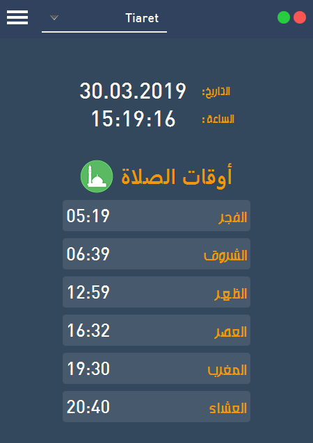

# Prayer Times  أوقات الصلاة

Desktop app for calculating Muslim prayer times and setting and alarm for the prayer times.  
أداة تساعدك على معرفة أوقات الصلاة في ولايتك وتقوم كذلك بتشغيل الأذان عندما يحين موعد الصلاة

### Features
* Simple to use 
* All cities of Algeria have been added.
* Remember your settings (selected city, adan, ..ect)

### Libraries used
* JFoenix (Material design)
* FontAwesomeFx (Icons)
* Apache HttpComponents jars (For rest webservice)
* Unirest (Get data from webservice)
* JSON (Parse JSON)

### Requirements
* Java version 8 or higher.
* Internet connection.

### Installation
1. Download the repository files (project) from the download section or clone this project by typing in the bash the following command:

       git clone https://github.com/HouariZegai/PrayerTimes.git
2. Open it in Intellij IDEA and download the libraries used (montioned above) and add it in the project.
3. Run the application :D

### Screenshoot
* Prayer times

* Settings

### Contributing
If you want to contribute to this project and make it better with new ideas, your pull request is very welcomed.
If you find any issue just put it in the repository issue section, thank you.

### Follow me
[Facebook](https://www.facebook.com/GeekHouari) |
[Youtube](https://www.youtube.com/HouariZegai) |
[Twitter](https://www.twitter.com/HouariZegai) |
[Instagram](https://www.instagram.com/HouariZegai)

.سبحَانَكَ اللَّهُمَّ وَبِحَمْدِكَ، أَشْهَدُ أَنْ لا إِلهَ إِلأَ انْتَ أَسْتَغْفِرُكَ وَأَتْوبُ إِلَيْكَ