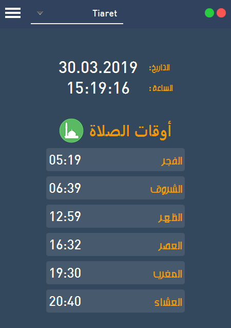
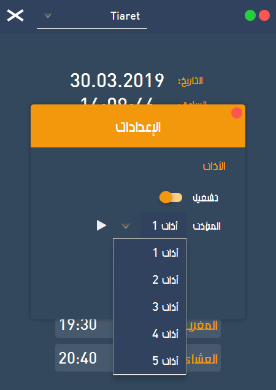
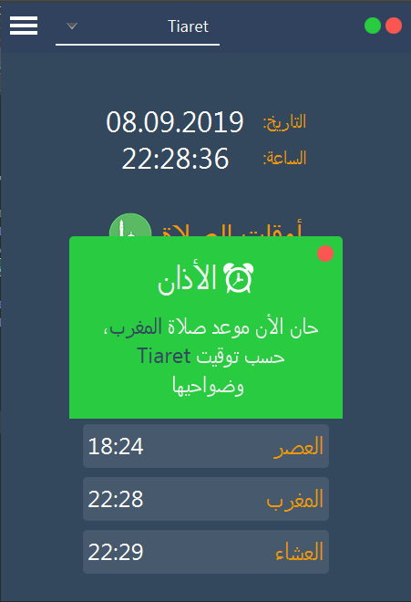

# Prayer Times  أوقات الصلاة
[](https://raw.githubusercontent.com/HouariZegai/PrayerTimes/master/LICENSE)

Desktop app for calculating Muslim prayer times 🕌 and setting an alarm (Adhan) :alarm_clock: for the prayer times. <br />
أداة تساعدك على معرفة أوقات الصلاة في ولايات الجزائر وتقوم كذلك بتشغيل الأذان عندما يحين موعد الصلاة

## Features
* [x] Simple to use 
* [x] All Algeria cities have been added
* [x] Remember your settings (selected city, adhan, ..ect)
* [x] Can hide the app to be on the system tray

## Screenshots
Main screen           | Settings Page
:---------------------:|:------------------:
 | 
Adhan (Alarm)           |
 |

## Requirements
* Java11+
* Maven

## Installation
1. Download the repository (project) from the download section or clone it using the following command:
   ```shell
   git clone https://github.com/HouariZegai/PrayerTimes.git
   ```
2. Run the app by running the maven command inside the project folder:
   ```shell
   mvn clean javafx:run
   ```

## Contributing 💡
If you want to contribute to this project and make it better with new ideas, your pull request is very welcomed.
If you find any issue just put it in the repository issue section, thank you.